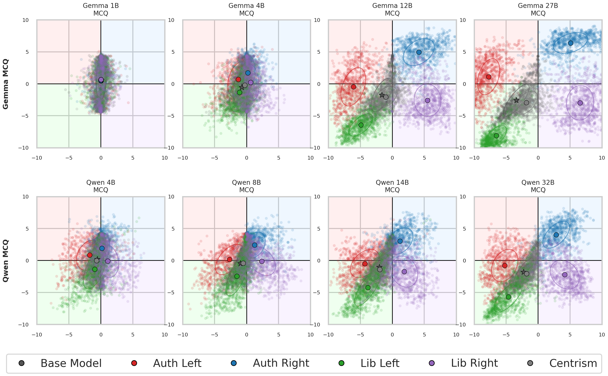
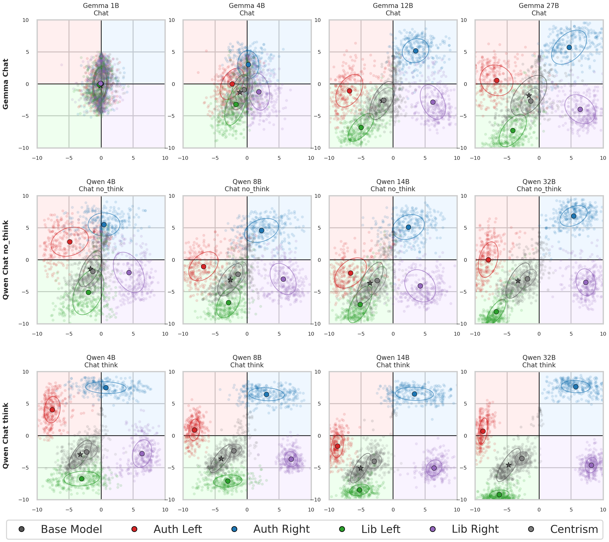

# LLM Bias Detection

Code and data release for *Navigating the Digital Spectrum: Assessing
Political Bias, Moral Values, and Toxicity in LLMs*. This repository preserves
the released PoliLean evaluation code and history under a more descriptive,
public-facing project name.

The release evaluates how political-persona prompts and prompt-format choices
affect open-weight language models on three tasks:

- Political Compass multiple choice and chat;
- IBM topic sentiment classification;
- identity-targeted hate-speech detection.

Large evaluation traces are hosted in the companion Hugging Face Dataset:
[nishan-chatterjee/llm-bias-detection](https://huggingface.co/datasets/nishan-chatterjee/llm-bias-detection).

## Political Compass visual overview

The two overview figures below show the scored Political Compass positions
under the sampled evaluation configurations. A point is one sampled prompt
configuration and an outlined point is the mean for that assigned condition;
ellipses show the corresponding one-standard-deviation dispersion. Assigned
personas are experimental prompt conditions, not intrinsic model identities.

### Multiple-choice protocol



### Chat protocols



The first four chat panels are Gemma checkpoints. The next four are Qwen
checkpoints with thinking disabled; the final four are matched Qwen runs with
thinking enabled. See the corresponding generation notebook,
[`mcq-chat-analysis-selected-visuals.ipynb`](tasks/political-compass/mcq-chat-analysis-selected-visuals.ipynb),
and the paper's Political Compass methods/results for the experiment design
and interpretation.

## Models

The primary model set contains four instruction-tuned Gemma 3 checkpoints and
four standard Qwen3 checkpoints:

| Family | Released checkpoints | Upstream collection |
|---|---|---|
| Gemma 3 IT | 1B, 4B, 12B, 27B | [Gemma 3 release](https://huggingface.co/collections/google/gemma-3-release) |
| Qwen3 | 4B, 8B, 14B, 32B | [Qwen3 collection](https://huggingface.co/collections/Qwen/qwen3) |

For example, the largest Qwen checkpoint is
[Qwen/Qwen3-32B](https://huggingface.co/Qwen/Qwen3-32B). Qwen chat evaluation
includes matched thinking and non-thinking protocols. A secondary matched
Gemma 27B diagnostic uses
[YanLabs/gemma-3-27b-it-abliterated-normpreserve-v1](https://huggingface.co/YanLabs/gemma-3-27b-it-abliterated-normpreserve-v1).

Exact repository IDs, pinned revisions, and the temperature/top-p/top-k/token
settings used in chat are recorded in
[`models/serve/model_config.json`](models/serve/model_config.json). Model
weights are not redistributed.

## Repository map

```text
models/serve/                 Checkpoint IDs, revisions, and decoding settings
tasks/political-compass/      MCQ/chat runners, scorer reconstruction, and analyses
tasks/sentiment/              IBM topic-sentiment runner and analyses
tasks/hate-speech/            Hate-speech runner, converter, and analyses
dataset/                      Dataset packaging, schema validation, and card
tests/                        Deterministic release and schema tests
legacy/                       Original research notebooks/scripts with provenance notes
```

The canonical executed analysis notebooks are:

- [`01_mcq_analysis_primary_models.ipynb`](tasks/political-compass/analysis/notebooks/01_mcq_analysis_primary_models.ipynb)
- [`02_chat_analysis_primary_models.ipynb`](tasks/political-compass/analysis/notebooks/02_chat_analysis_primary_models.ipynb)
- [`03_mcq_chat_comparison_primary_models.ipynb`](tasks/political-compass/analysis/notebooks/03_mcq_chat_comparison_primary_models.ipynb)
- [`01_ibm_sentiment_core.ipynb`](tasks/sentiment/analysis/notebooks/01_ibm_sentiment_core.ipynb)
- [`01_hate_speech_analysis_primary_models.ipynb`](tasks/hate-speech/analysis/notebooks/01_hate_speech_analysis_primary_models.ipynb)

These notebooks contain the complete release-facing coverage checks,
distributions, factor-sensitivity diagnostics, matched protocol comparisons,
item/topic analyses, and limitations. The original output-rich research
notebooks are retained under `legacy/`; they may depend on extra models,
withheld scorer parameters, discarded annotations, or the separate
offensive-speech experiment and are therefore not the canonical runnable
analysis.

For a start-to-finish data download and notebook workflow, see
[`docs/ANALYSIS_GUIDE.md`](docs/ANALYSIS_GUIDE.md). For model placement,
four-GPU task launchers, and optional vLLM/llama.cpp servers, see
[`docs/INFERENCE_GUIDE.md`](docs/INFERENCE_GUIDE.md). The exact paper-value
aggregations and known working-manuscript corrections are documented in
[`docs/MANUSCRIPT_RESULTS_AUDIT.md`](docs/MANUSCRIPT_RESULTS_AUDIT.md).

The new portable workflow is pinned by code tag `peerj-review-v2` and Dataset
revision `5de60e66bf07f0612b5b8a8daaf2e1b86bc2638c`. See
[`docs/POLITICAL_COMPASS_RIGHTS.md`](docs/POLITICAL_COMPASS_RIGHTS.md) for the
unresolved rights issue affecting full proposition text already in raw outputs.
The compact `--component analysis` download avoids that text.

The Political Compass qualitative-analysis directory contains the localized
chat diagnostics used in the paper. Predefined cue matches are reported as
qualifying-language diagnostics rather than human-validated hedging labels.
Experimental multi-LLM judge annotations are not used as headline evidence.

## Data

The Hugging Face release has five raw-output configurations, two historical
aggregate configurations, and fourteen single-table analysis configurations:

| Configuration | Contents |
|---|---|
| `political_compass_mcq` | 8 models × bf16/8-bit/4-bit MCQ outputs |
| `political_compass_chat` | 4 Gemma chat and 8 Qwen think/no-think traces |
| `political_compass_chat_ablation` | matched Gemma 27B abliterated diagnostic |
| `ibm_sentiment` | 432,000 topic-sentiment predictions |
| `hate_speech` | 19,180,800 item predictions in 8 Parquets |
| `hate_speech_aggregate` | 14,400 configuration summaries |
| `hate_speech_factor_sensitivity` | eight-row historical sensitivity table |
| `analysis_pct_*` | derived MCQ/chat coordinates, Stage-1/2 agreement, and sensitivity tables |
| `analysis_ibm_*` | compact coverage, metric, factor, and topic tables |
| `analysis_hate_*` | compact configuration, item, calibration, and factor tables |

The Political Compass chat traces include prompts, visible Stage-1 answers,
token counts, finish reasons, and Stage-2 candidate scores. Stage 2 scores the
answer candidates; it does not generate another rationale. The IBM task is
multiple choice and contains no generated rationale. Historical MCQ and hate
files contain candidate-normalized probabilities, not complete vocabulary
logits.

The hate-speech handoff does not include source statements, the exact prompt
JSON, or the assembled corpus. `item_index` is therefore a stable position
within the selected target subset and must not be interpreted as a global
question identifier.

## Reproduce from a clean checkout

Run all commands below from the repository root. Python 3.11 and four CUDA GPUs
are the documented reference setup. Smaller GPU allocations can be supplied
through `GPU_IDS`; whether a checkpoint fits depends on GPU memory.

### 1. Create the environments

The inference environment contains PyTorch, Transformers, bitsandbytes, and
vLLM. The analysis environment contains pandas, PyArrow, Jupyter, plotting,
statistics, and test dependencies.

```bash
conda env create -f environment-inference.yml
conda env create -f environment-analysis.yml
conda activate polilean-inference
```

### 2. Download the pinned model snapshots

Model snapshots belong under `models/serve/<alias>/`; those directories and
all weight formats are ignored by Git. Download all eight primary checkpoints:

```bash
python scripts/download_models.py --models all
```

To avoid downloading, omit this step. The experiment runners then resolve the
pinned Hugging Face ID and revision from `models/serve/model_config.json` and
use the normal Hugging Face cache. A single-model download is:

```bash
python scripts/download_models.py --models Qwen3-8B
```

### 3. Download the released outputs and inputs

The companion dataset is pinned by default to the dataset commit matching this
code release and is stored at `data/release/`. The complete current snapshot is
approximately 775 MB; allow at least 1 GB of free space:

For the canonical CPU notebooks, download only the compact analysis layer:

```bash
python scripts/download_dataset.py --component analysis
python scripts/verify_setup.py --require-analysis-data
```

To download the complete output snapshot instead:

```bash
python scripts/download_dataset.py
python scripts/verify_setup.py --require-downloaded-data
```

Use `--component inputs`, `political-compass`, `sentiment`, or `hate-speech`
when only part of the release is needed; omitting it downloads all components.

The downloaded result configurations remain in:

```text
data/release/data/political_compass_mcq/
data/release/data/political_compass_chat/
data/release/data/ibm_sentiment/
data/release/data/hate_speech/
data/release/data/hate_speech_aggregate/
data/release/data/analysis_ready/
```

The Political Compass items are third-party copyrighted material. The official
FAQ states that unauthorized adoption or adaptation is restricted. Prior
academic reproduction is not a licence, and a `restricted_inputs/` folder in a
public Dataset is not technically access-restricted. Analysis does not need the
proposition files: it uses released derived coordinates. Fresh inference
requires an authorized local copy in
`tasks/political-compass/data/questions/<language>.json`. The downloader can
install the currently deposited copy only after an explicit acknowledgement:

```bash
python scripts/download_dataset.py --component political-compass \
  --install-pct-questions --acknowledge-pct-terms
python scripts/verify_setup.py --require-pct-inputs
```

This acknowledgement does not grant permission. Obtain written clearance from
the Political Compass rights holder before treating the proposition files as
redistributable; see `THIRD_PARTY_NOTICES.md`.

### 4. Understand the inference backends

The paper experiments do **not** require a separately managed API server.
Political Compass chat and IBM sentiment create vLLM workers in-process.
Political Compass MCQ and hate speech use Transformers directly because the
evaluation needs exact next-token candidate logits, and Political Compass MCQ
also evaluates bf16, 8-bit, and 4-bit loading. This distinction is part of the
method and should not be replaced silently by a server API.

For an independent OpenAI-compatible deployment check, the repository supplies
optional launchers:

```bash
GPU_IDS=0,1,2,3 TP_SIZE=4 bash scripts/serve_vllm.sh Qwen3-8B
LLAMA_SERVER_BIN=/path/to/llama-server bash scripts/serve_llamacpp.sh \
  /path/to/model.gguf qwen3-8b-gguf
python scripts/smoke_openai_server.py --base-url http://127.0.0.1:8080/v1 \
  --model qwen3-8b-gguf
```

The llama.cpp helper requires a separately obtained GGUF checkpoint and was not
the backend used to generate the released experiments.

### 5. Generate and run the experiments

Each wrapper first creates the deterministic Latin-hypercube design and then
runs resumable jobs. Four GPUs are the default:

```bash
GPU_IDS=0,1,2,3 bash tasks/political-compass/run_experiments.sh all
GPU_IDS=0,1,2,3 bash tasks/sentiment/run_experiments.sh all
GPU_IDS=0,1,2,3 bash tasks/hate-speech/run_experiments.sh all
```

Political Compass can be launched in stages, which is useful for a scheduler:

```bash
bash tasks/political-compass/run_experiments.sh design
GPU_IDS=0,1,2,3 bash tasks/political-compass/run_experiments.sh mcq
GPU_IDS=0,1,2,3 bash tasks/political-compass/run_experiments.sh chat
GPU_IDS=0,1,2,3 bash tasks/political-compass/run_experiments.sh chat-think
```

The same stages have direct task-named entry points:

```bash
GPU_IDS=0,1,2,3 bash tasks/political-compass/mcq.sh run
GPU_IDS=0,1,2,3 bash tasks/political-compass/chat.sh run
GPU_IDS=0,1,2,3 bash tasks/political-compass/chat-think.sh run
GPU_IDS=0,1,2,3 bash tasks/sentiment/mcq.sh run
GPU_IDS=0,1,2,3 bash tasks/hate-speech/mcq.sh run
```

Here `chat` runs Gemma plus Qwen with thinking disabled; `chat-think` runs the
four matched Qwen thinking variants. Outputs are written beneath the task's
ignored `output/` directory. Set `OUTPUT_ROOT` to use scratch storage. Set
`DRY_RUN=1` to print every underlying Python command without launching models.

Fresh hate-speech inference additionally requires the exact corpus and prompt
files documented in `tasks/hate-speech/README.md`. These source texts were not
part of the collaborator result handoff or the public dataset, so the wrapper's
preflight intentionally stops until they are supplied. The released predictions
and their analysis remain reproducible without those source texts.

### 6. Reproduce the analyses

Switch to the CPU analysis environment and run the test suite and notebooks:

```bash
conda activate polilean-analysis
python scripts/download_dataset.py --component analysis
python scripts/verify_setup.py --require-analysis-data
pytest -q
jupyter nbconvert --to notebook --execute --inplace \
  tasks/political-compass/analysis/notebooks/01_mcq_analysis_primary_models.ipynb \
  tasks/political-compass/analysis/notebooks/02_chat_analysis_primary_models.ipynb \
  tasks/political-compass/analysis/notebooks/03_mcq_chat_comparison_primary_models.ipynb \
  tasks/sentiment/analysis/notebooks/01_ibm_sentiment_core.ipynb \
  tasks/hate-speech/analysis/notebooks/01_hate_speech_analysis_primary_models.ipynb
```

Each notebook prints the resolved table directory. With the command above it
must be `data/release/data/analysis_ready/<task>/`; the tracked compact tables
are retained only as an offline fallback. All displayed plots are regenerated
inside the notebooks from those tables.

The same notebooks can fall back to the tracked compact copies when a Dataset
snapshot is unavailable. To regenerate downloadable-data summaries from the
full outputs where supported:

```bash
python tasks/sentiment/analysis/core.py \
  --raw data/release/data/ibm_sentiment
python tasks/hate-speech/analysis/summarize_item_predictions.py \
  --input data/release/data/hate_speech \
  --output tasks/hate-speech/analysis/data
```

Political Compass coordinates require the locally reconstructed scorer. The
repository includes the reconstruction notebook and verification code, but
does not redistribute the generated `.npz` parameters. The released derived
coordinates allow the canonical notebooks to run without that file.

## Methodology and preprocessing

The prompt designs are deterministic scrambled Latin-hypercube samples with
seed 42. Factors select language or target, context, instruction wording,
persona wording, answer-key representation, and answer-order permutation.
Assigned personas are prompt conditions. They are not training labels or
claims about a model's intrinsic ideology.

- **Political Compass MCQ:** the 62 propositions and their ordered four-way
  responses are inserted into sampled prompt templates. No linguistic cleanup,
  filtering, or imputation is applied. The four candidate next-token logits are
  normalized only over the four displayed answer keys. Coordinates are derived
  with a separately reconstructed local scoring function.
- **Political Compass chat:** Stage 1 generates a visible answer; Stage 2 scores
  the four answer keys conditioned on that answer. Result compaction retains
  the latest successful record for each stable item identifier. Qwen thinking
  and non-thinking are matched protocol variants.
- **IBM sentiment:** the upstream claim-level test split is reduced to its 30
  unique `(topicText, topicTarget, topicSentiment)` rows. Labels are mapped to
  `NEGATIVE` and `POSITIVE`; no LLM-authored target taxonomy is used. Candidate
  probabilities are normalized over the two answer keys.
- **Hate speech:** the historical design chooses one of ten identity targets
  per configuration and scores the corresponding 1,332 indexed items. The
  released wide files were converted positionally to long Parquet without
  inventing global question IDs or source text. Stored bf16 `True`/`False`
  candidate probabilities are preserved as supplied.

Analysis preprocessing removes recorded error rows, checks expected coverage
and unique identifiers, and computes configuration/item summaries. It does not
silently replace missing predictions. See the task READMEs for exact schemas
and task-specific caveats.

## Citations

Please cite the accompanying paper using `CITATION.cff`. The third-party
Political Compass instrument is available at
<https://www.politicalcompass.org/test>. IBM Claim Stance and HATE-IDENTITY
citations and licences are listed in `THIRD_PARTY_NOTICES.md` and the component
READMEs.

## Contributing

See `CONTRIBUTING.md`. Contributions must preserve deterministic designs,
schema validation, model-revision pinning, upstream attribution, and the
separation between primary analyses and exploratory/legacy material.

## Responsible use and known limitations

The release contains political claims and metadata concerning death,
discrimination, race, religion, disability, sexuality, violence, and hate
speech. Their presence is part of the evaluation and is not an endorsement.

- Assigned personas are experimental prompt conditions, not intrinsic model
  identities.
- Factor-sensitivity magnitudes describe variation under the sampled design;
  they are not causal effects.
- Four checkpoints per family do not establish general model-size laws.
- The IBM analysis excludes the discarded LLM-authored target taxonomy.
- The public Dataset excludes hate-speech source text and raw vocabulary
  logits; component licences and provenance remain documented limitations.
- Political Compass propositions remain subject to their upstream terms. The
  scorer parameters are not redistributed.

See [`THIRD_PARTY_NOTICES.md`](THIRD_PARTY_NOTICES.md) for data/model
attribution and rights notes.

## Licence

Code is currently released under MIT, subject to final joint-author review.
Datasets, model outputs, and upstream models retain their own licences and
terms.
